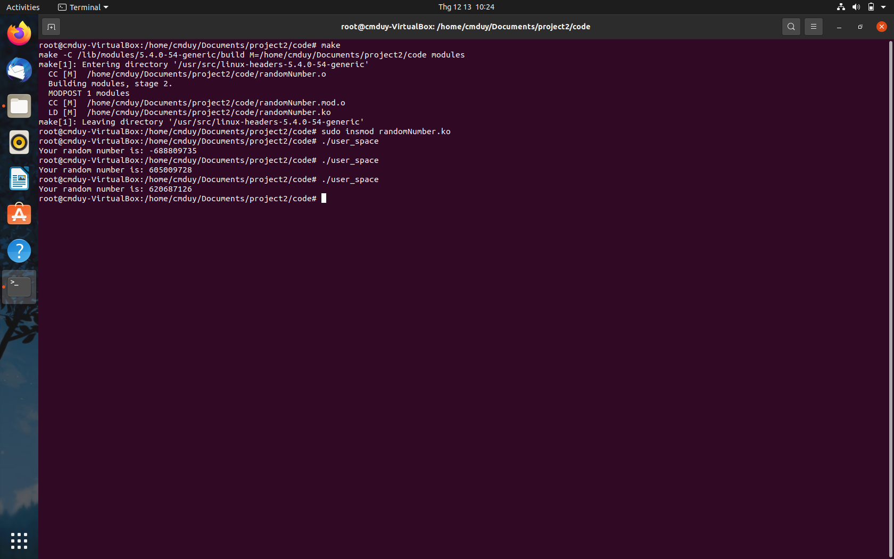
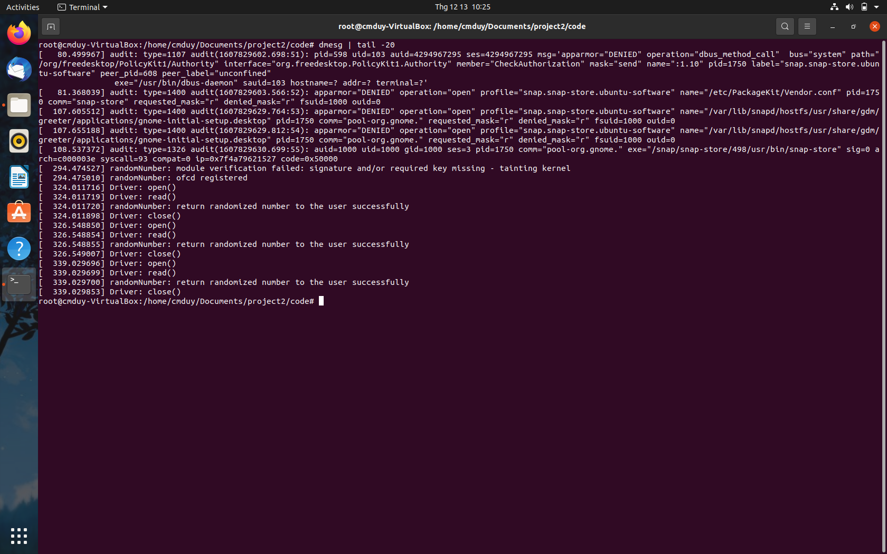

# Tìm hiểu và lập trình Linux Kernel Module

## Mục tiêu đồ án

- Mục tiêu là hiểu về Linux kernel module và hệ thống quản lý file và device trong linux, giao tiếp giữa tiến trình ở user space và code kernel space. 
- Viết một module dùng để tạo ra số ngẫu nhiên và module này sẽ tạo một character device để cho phép các tiến trình ở userspace có thể open và read các số ngẫu nhiên.

## Thành viên:
Nhóm gồm 3 thành viên
- `18120129` - Lô nguyễn Tuấn Khiêm [@01230123]
- `18120313` - Trần Tuấn Đạt [@bobyba2000]
- `18120338` - Cao Minh Duy [@meowmeowplus]

## Tiến độ hoàn thành
- Mức độ nhiệt tình và hoàn thành công việc:
  * Lô Nguyễn Tuấn Khiêm: 100%
  * Trần Tuấn Đạt: 100%
  * Cao Minh Duy: 100%
- Tiến độ: đã hoàn thành 100%

## Một số hàm được sử dụng

### `make`
- Dùng để biên dịch kernel module
- Khi ta gõ lệnh `make`, tiến trình make sẽ dựa vào Makefile để biên dịch mã nguồn, tạo ra kernel module.
- Sau khi biên dịch xong, ta sẽ thấy xuất hiện môt file có tên mở rộng là .ko (ko là viết tắt của kernel object). Đây chính là kernel module.

### Tháo lắp module
- Để lắp module vào trong kernel, ta có thể thực hiện thủ công bằng cách gõ lệnh `insmod`. 
- Sau khi lắp xong, ta sẽ dùng lệnh `lsmod` để kiểm tra xem module đã được load thành công chưa. 
- Tiếp theo, ta sẽ dùng lệnh `dmesg` để theo dõi quá trình hoạt động của module. 
- Cuối cùng, chúng ta sẽ dùng lệnh `rmmod` để tháo module ra khỏi kernel.

- **Ghi chú**: `dmesg` sẽ in ra tất cả quá trình hoạt động của các module nên ta có thể chỉ xem một phần của nó cho ngắn gọn

```bash
# Show 10 lastest line of dmesg
dmesg | tail -10
```
## module `randomNumber`

### Cách sử dụng

```bash
//Build user_space.c file
$ gcc -o user_space user_space.c 

// Build module
$ make

// Insert module
$ insmod randomNumber.ko

// Run user tool 
$ ./user_space

// Remove module
$ rmmod randocha

// Cleaning
$ make clean
```
### Cấu trúc

**File operation**
- `device_open` : dùng để mở device, hàm sẽ xuất thông báo là đã mở được chưa.
- `device_close` : sau khi thực hiện xong, xuất thông báo đóng device.
- `device_read` : tạo ra một số ngẫu nhiên dùng hàm `get_random_byte()`, sau đó sẽ trả số đó cho user thông qua user_space. Cuối cùng xuất ra thông báo là có trả về được hay không.

**Module**

- Hàm khởi tạo module
  * Kết nối các thao tác file thiết bị với các hàm tương ứng trong driver dùng hàm `int alloc_chrdev_region()`
  * Tạo device class với tên được định nghĩa sẵn
  * Tạo device với các thông tin đã khởi tạo bên trên.
  * Khởi tạo cấu trúc thiết bị kiểu character bằng cách khai báo biến cấu trúc `struct cdev c_dev` và gọi hàm `cdev_init()`.
  * Điều khiển cấu trúc này đến hệ thống file ảo VFS bằng cách gọi hàm `cdev_add()`.

- Hàm gỡ module
  * Gỡ cấu trúc thiết bị bằng ` cdev_del()`
  * Hủy thiết bị `device_destroy()`
  * Hủy lớp thiết bị `class_destroy()`
  * Hủy kết nối ` unregister_chrdev_region()`

### Ảnh chụp 

- Hình `make` , `insert` module và chạy công cụ test.


- Hình chạy lệnh `dmesg` cho thấy module đã được nạp và trả kết quả về thành công.


